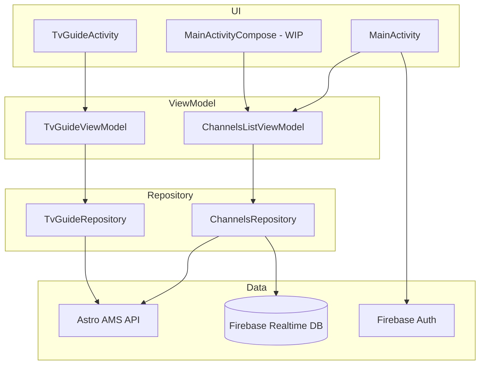

# Astro TV Guide

An Android app for Astro Malaysia direct-TV subscribers. Browse the channel lineup, mark favourites, and explore a paginated TV guide of currently airing and upcoming programmes across all channels.

## Features

### Channels (Home screen — `MainActivity`)

- Displays the full Astro channel list with **channel ID** and **channel title**.
- **Sort** all channels by name (ascending/descending) or channel number (ascending/descending).
- **Favourites**: tap the heart icon to mark or unmark a channel. Favourites appear in a dedicated section above the full list.
- **Google Sign-In** (Firebase Authentication) is required to manage favourites. If a guest taps the heart icon, the sign-in flow is launched first.
- **Persisted preferences**: when signed in, favourites and sort order are stored in **Firebase Realtime Database** and restored on the next login.
- Navigate to the TV Guide from the overflow menu.

### TV Guide (`TvGuideActivity`)

- Shows programmes currently on air (and upcoming) across all channels loaded from the home screen.
- **Grid layout** (2 columns) with programme banner image, title, channel name, and channel ID.
- **Sort** by channel name or channel number (ascending/descending).
- **Pagination / lazy load**: scroll to the bottom to fetch the next time window. Each page covers a **30-minute** slot; scrolling continues until roughly **7 days** of schedule data have been loaded.
- Programme images are loaded with **Glide**.

### Authentication & cloud sync

| Data | Firebase path | When synced |
|------|---------------|-------------|
| Favourite channels | `/favourites/{channelId}` | On toggle (signed-in users only) |
| Sort order | `/sort_order` | When user changes sort from the menu |

## Architecture

The app follows **MVVM** with a **Repository** pattern and **Hilt** dependency injection.



### Layer responsibilities

| Layer | Package | Role |
|-------|---------|------|
| **View** | `view/`, `ui/` | Activities, XML data-binding layouts, RecyclerView adapters. A Jetpack Compose variant (`MainActivityCompose`) exists but is not registered as the launcher. |
| **ViewModel** | `viewmodel/` | Exposes `LiveData` to the UI; survives configuration changes. Annotated with `@HiltViewModel`. |
| **Repository** | `repository/` | Single source of truth: fetches from Retrofit or Firebase, returns `LiveData`. `@Singleton` via Hilt. |
| **Network** | `webhelper/`, `di/` | Retrofit `AstroAPi` interface and `NetworkModule` (OkHttp + Gson). |
| **Model** | `model/` | Gson-deserializable POJOs. `ChannelsListModel.Channel` extends `BaseObservable` for data binding. |
| **DI** | `di/` | Hilt `NetworkModule` provides `OkHttpClient`, `Retrofit`, and `AstroAPi`. |
| **App** | `AstroApplication` | `@HiltAndroidApp` entry point. |

### Data flow example — loading channels

1. `MainActivity` obtains `ChannelsListViewModel` via `ViewModelProvider`.
2. ViewModel delegates to `ChannelsRepository.getChannelList()`.
3. Repository calls `GET http://ams-api.astro.com.my/ams/v3/getChannelList` through Retrofit.
4. Response is posted to `MutableLiveData<ChannelsListModel>`; the Activity observes and binds to `RecyclerView` adapters.
5. Favourites and sort order are observed separately from Firebase Realtime Database listeners.

### Data flow example — TV guide pagination

1. `MainActivity` passes all channel IDs to `TvGuideActivity` via intent extra (`BundleKeys.CHANNELS_LIST`).
2. `TvGuideViewModel` asks `TvGuideRepository` for `periodStart` / `periodEnd` time windows.
3. First page: `periodStart` = now, `periodEnd` = now + 30 minutes.
4. Subsequent pages: `periodStart` = previous `periodEnd` + 1 second, `periodEnd` = +30 minutes.
5. API call: `GET ams/v3/getEvents/?periodStart=…&periodEnd=…&channelId=1,2,3,…`
6. `RecyclerView.OnScrollListener` triggers `loadMoreItems()` when the user reaches the bottom.

## External services

### Astro AMS API

| Setting | Value |
|---------|-------|
| Base URL | `http://ams-api.astro.com.my/` (configured in `gradle.properties` → `BuildConfig.URL`) |
| Required header | `city_id: 10` (added by `NetworkModule` OkHttp interceptor) |
| Channel list | `GET /ams/v3/getChannelList` |
| TV guide events | `GET /ams/v3/getEvents/?periodStart&periodEnd&channelId` |

The app uses HTTP (cleartext); `android:usesCleartextTraffic="true"` is set in the manifest.

### Firebase

- **Authentication** — Google Sign-In via Firebase UI Auth (`AuthUI.IdpConfig.GoogleBuilder`).
- **Realtime Database** — stores favourites and sort order per authenticated user.

## Tech stack

| Category | Libraries |
|----------|-----------|
| Language | Java (primary UI), Kotlin (Compose UI — in progress) |
| Min / Target SDK | 21 / 34 |
| Architecture | MVVM, LiveData, Repository |
| DI | Dagger Hilt |
| Networking | Retrofit 2.9, OkHttp 4.12, Gson |
| UI | XML + Data Binding, RecyclerView, Material Components |
| UI (WIP) | Jetpack Compose, Material 3 |
| Images | Glide 4.16 |
| Backend | Firebase Auth, Firebase Realtime Database, Firebase UI Auth |
| Build | Gradle 8.2, AGP 8.1.4, Version Catalog (`gradle/libs.versions.toml`) |

## Project structure

```
app/src/main/java/com/mukeshteckwani/astro/astroapp/
├── AstroApplication.java          # Hilt application class
├── adapter/                       # RecyclerView adapters + data-binding adapters
├── di/NetworkModule.java          # Retrofit / OkHttp wiring
├── model/                         # ChannelsListModel, TvGuideModel
├── repository/                    # ChannelsRepository, TvGuideRepository
├── view/                          # MainActivity, TvGuideActivity, MainActivityCompose
├── viewmodel/                     # ChannelsListViewModel, TvGuideViewModel
├── webhelper/                     # AstroAPi Retrofit interface
├── ui/                            # Compose screens, components, theme (WIP)
└── utils/                         # Constants, date helpers, item decorations
```

## Getting started

### Prerequisites

- JDK 17
- Android SDK (API 34, build-tools 34.0.0)
- `local.properties` with `sdk.dir` pointing to your Android SDK

### Build & run

```bash
./gradlew assembleDebug          # Build debug APK
./gradlew installDebug           # Install on connected device/emulator
./gradlew build                  # Full CI build (compile + tests + lint)
```

### Firebase / Google Sign-In setup

To enable Google Sign-In on your own Firebase project:

1. Create a project in the [Firebase Console](https://console.firebase.google.com/).
2. Enable **Firebase Authentication** (Google provider).
3. Enable **Firebase Realtime Database**.
4. Register your debug **SHA-1** fingerprint in the Firebase project settings.
5. Download a new `google-services.json` and replace `app/google-services.json`.

## CI

GitHub Actions workflow (`.github/workflows/android.yml`) runs `./gradlew build` on push/PR to `master` with JDK 17 and Android SDK 34.
