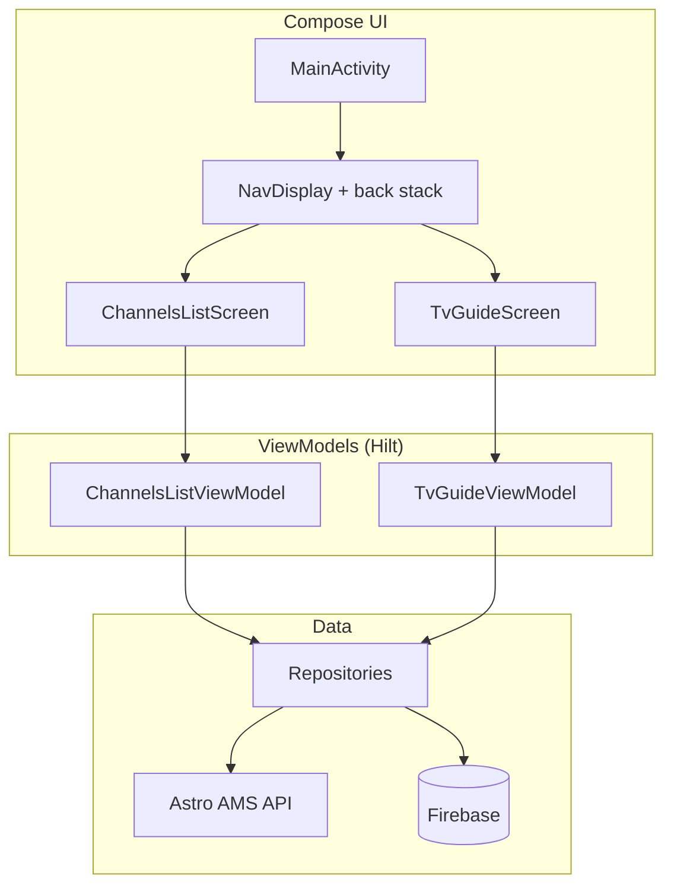

# Astro TV Guide

An Android app for Astro Malaysia direct-TV subscribers. Browse channels, manage favourites, and explore a paginated TV guide — built entirely with **Jetpack Compose** and **Navigation 3**.

## Features

- **Channels** — list, sort (name / channel number), favourites with Google Sign-In, Firebase sync
- **TV Guide** — 2-column grid, lazy-loaded 30-minute schedule windows (~7 days), sortable
- **Firebase** — Authentication (Google) + Realtime Database for favourites and sort order

## Architecture



| Layer | Package | Notes |
|-------|---------|-------|
| **UI** | `view/`, `ui/`, `navigation/` | Single `MainActivity`, Navigation 3 `NavDisplay`, Material 3 |
| **ViewModel** | `viewmodel/` | Kotlin + `StateFlow`, Hilt-injected |
| **Repository** | `repository/` | Retrofit + Firebase Realtime Database |
| **DI** | `di/` | Hilt `NetworkModule` |

### Navigation 3

Destinations are typed keys (`ChannelsKey`, `TvGuideKey`) on a `mutableStateListOf` back stack. `NavDisplay` renders the top entry via `entryProvider { ... }`.

## Tech stack

| Category | Choice |
|----------|--------|
| UI | Jetpack Compose, Material 3 |
| Navigation | Navigation 3 (`navigation3-runtime`, `navigation3-ui`) |
| Images | Coil |
| DI | Dagger Hilt |
| Networking | Retrofit, OkHttp, Gson |
| Async | Kotlin Coroutines, StateFlow |
| Min / compile SDK | 23 / 36 |

**Removed (legacy View layer):** XML layouts, Data Binding, RecyclerView adapters, AppCompat/Material Views, Glide.

## Build

```bash
./gradlew assembleDebug   # Build APK
./gradlew build           # Full CI build
```

Requires **JDK 17**, **Android SDK 36**, and `local.properties` with `sdk.dir`.

### Firebase setup

1. Create a Firebase project and enable Google Auth + Realtime Database.
2. Register your debug SHA-1 fingerprint.
3. Replace `app/google-services.json`.
